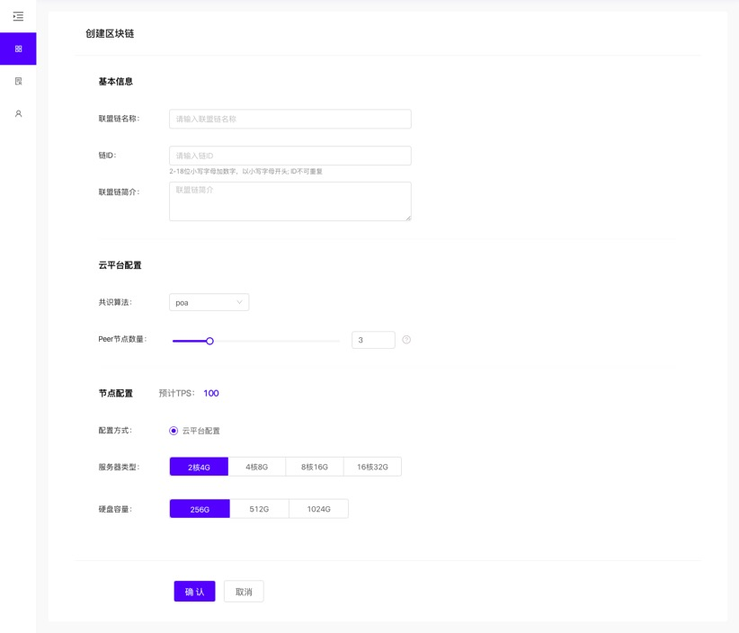

## 快速创建联盟链

### 背景介绍

本文介绍如何在BaaS平台中创建联盟链网络，包括设置联盟链基础信息、节点配置、调整链的状态等操作。

### 前提条件

已拥有氚平台账号。如尚未入驻，请首先联系平台方进行入驻。

**建链流程：**

1.	登录氚平台，点击左侧栏的BaaS平台，进入链列表;
2.	点击 "创建区块链";

3.	进入创建区块链页面，需要进行如下操作：

 
a. 填写联盟链基本信息，包括联盟链名称和联盟链简介；

b. 进行云平台配置，包括共识算法和节点数量，建议创建3-5个节点，若有特殊需求每个成员最大支持创建10个节点；

c. 进行节点配置，包括服务器类型和硬盘容量；
d. 设置完成后，点击 "确认" 按钮

4. 在链列表种可以看到该链的状态为“已构建”：

 
a. 点击“操作”中的【运行】，链的状态即变更为`待网络初始化`；

b. 点击【网络初始化】，等待10s左右时间后，链的状态变更为“已运行”，此时该链的创建就已完成;

