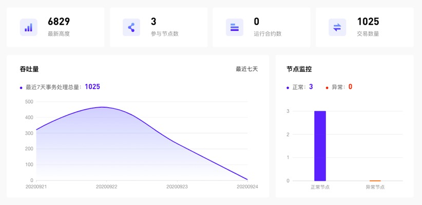
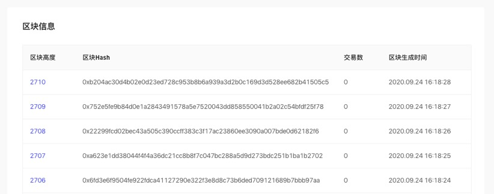

### 通过区块链浏览器监控联盟链的状态

**背景介绍**

本文介绍如何在BaaS平台中通过区块链浏览器查询联盟链的状态，包括联盟链基础数据、链内吞吐量监控、节点监控、实时区块展示。

**前提条件**

1. 已拥有氚平台账号。如尚未入驻，请首先联系平台方进行入驻。
2. 已创建联盟链，详情参见`快速创建联盟链`。
3. 已关联业务系统，并有上链数据产生，若未关联业务系统，请联系平台技术方提供支持。

**状态监控**

1. 基本数据监控

 
点击联盟链名称，进入`区块链浏览器`，可总览链的基础信息，包括区块最新高度、参与的节点数、交易数量等。

2. 吞吐量监控和节点监控

 
同时可监控最近7天的事务处理交易量变化趋势和节点健康状况。其中节点异常包括“无法检测到节点服务”和“节点服务所在的服务器宕机或服务异常” 两种情况；

3. 实时区块信息展示

 
点击区块高度可进入区块详情，查看区块基本信息。区块信息包括最新的区块高度、区块Hash、当前区块的交易数以及区块的生成时间。
