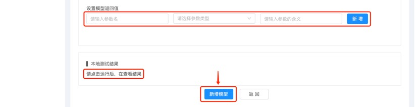

## 快速创建数据模型

本文介绍如何在氚平台的联邦可信计算后台上创建可使用的数据模型，包含快速创建数据模型、启用数据模型两部分。
数据模型是一段可执行的代码，这段代码允许用户输入一些参数。代码将从数据库里调取数据，进行运算，并返回用户想要的结果。

### 前提条件

1.	登录氚平台，前往联邦可信计算后台的数据模型管理页。
2.	已经接入了数据源。

### 新增数据模型

1.	在数据模型管理页，点击`新增`按钮，进入新增数据模型页。
 

2.	在新增数据模型页，配置模型具体信息：

  a. 输入模型名称。
  b. 选择所属业务、模型使用范围。模型使用范围默认为全局应用。
  c. 选择模型类型，目前仅有定制化模型可选。

 
3.	当数据模型的基本信息填写完毕后，再配置数据模型的详细信息。

a. 输入模型SQL代码。
b. 设置模型入参。可配置多个模型入参，每个模型入参可以设置参数名、参数类型、参数含义。

c. 添加模型使用数据。点击添加按钮后，则可从选择的所属业务（数据源）内，选择具体的数据表。选择好后，数据表呈置灰状态。再点击下一步按钮，则进入选择字段弹窗。

d. 在选择字段弹窗中，勾选需要使用的数据字段后，再点击确认添加按钮。点击该按钮后，则返回到新增数据模型页面，并将勾选的数据回填入“配置模型使用数据”表中。

e. 设置模型返回值。可配置多个模型返回值，但至少配置一个模型返回值。每个模型返回值配置时，可以设置参数名、参数类型、参数含义。

 
4.	点击运行按钮，可以本地测试运行模型，查看测试运行的结果。
5.	本地测试运行模型无误后，可以点击新增模型。

### 启用数据模型

1.	新增的数据模型，默认处于已禁用的状态。因此，需要在数据模型管理页，点击需启用的数据模型记录的启用按钮。

2.	在弹出的二次确认弹窗中，点击确定按钮，就可以启用该数据模型了。

