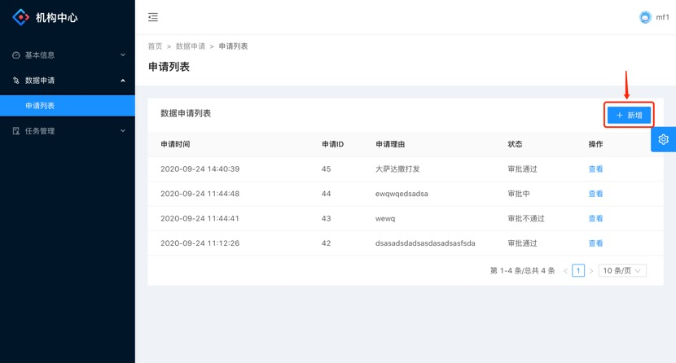
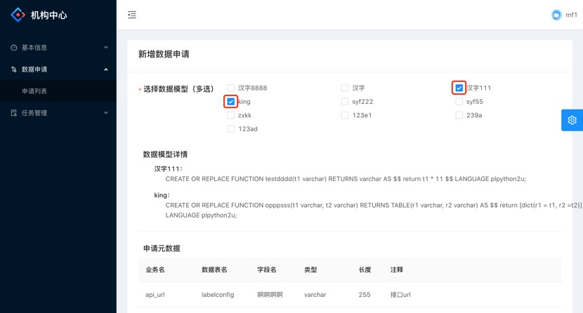
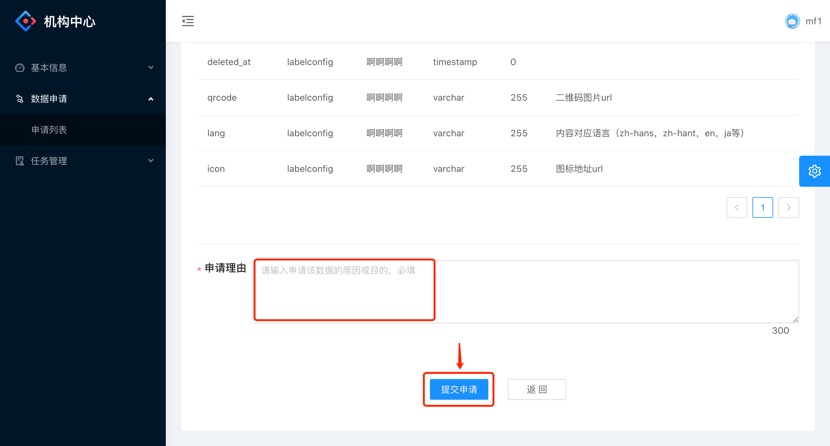

## 申请数据模型

本文介绍如何在氚平台的联邦可信计算机构中心上申请可使用的数据模型。

**前提条件**

1.	登录氚平台，前往联邦可信计算机构中心的数据申请列表页。
2.	联邦可信计算后台给该机构开放了某些数据模型的查看权限。

**新增数据申请**

1.	点击新增按钮，跳转进入新增数据申请页面。

2.	在新增数据申请页，勾选自己想申请的数据模型。每次勾选某个数据模型，则会将该模型的详情、模型所需数据自动展示出来。

3.	勾选完数据模型之后，填写申请理由。填写理由无误后，点击提交申请按钮，则可以直接提交申请，并返回至申请列表页。

 
