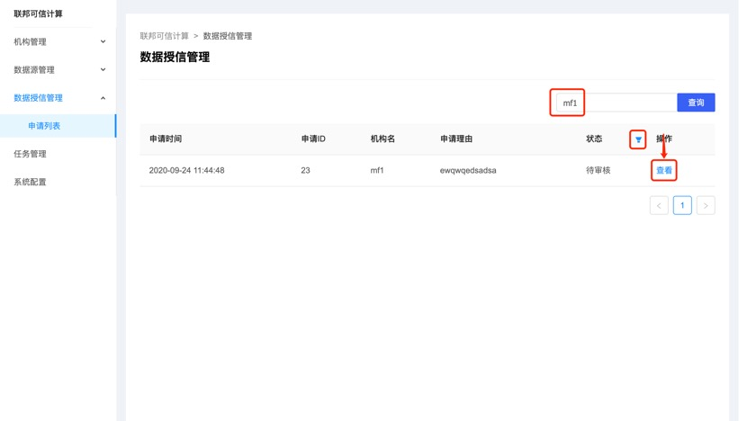
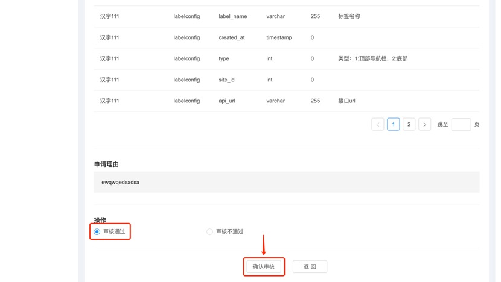

## 授信使用数据模型

本文介绍如何在氚平台的联邦可信计算后台上进行数据授信管理，审核数据申请是否可通过。

**前提条件**

1.	登录氚平台，前往联邦可信计算后台的数据授信管理页。
2.	联邦可信计算机构中心向后台申请了数据模型。

**审核数据申请**

1.	进入申请列表，通过机构筛选、状态筛选，找到需要授信的数据模型申请记录。点击查看按钮，则跳转进查看申请详情页。

2.	在查看申请详情页，下拉至页面最底部，点击审核通过选项，再点击确认审核按钮，即可将这些数据模型授信给某个机构使用。

