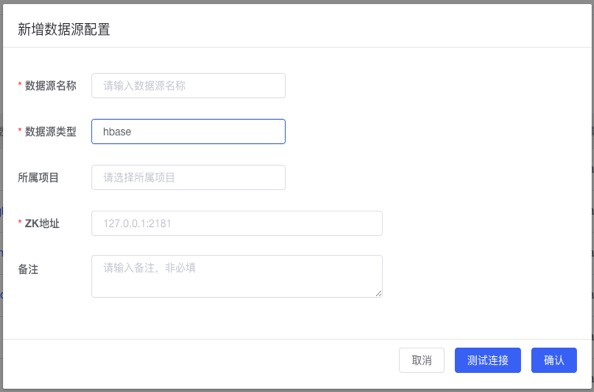

## 便捷管理数据源

数据源是存储数据的物理数据库。通过创建数据源的方式，将业务数据引入氚平台进行构建数据中台。同时您也可以将已构建完成的数据导入数据源。
进入`ETL平台`，单击`数据源管理`，可以对数据源进行统一管理，目前支持以下数据源：
`mysql`,`oracle`,`postgresql`,`sqlserver`,`ftp`,`hive`,`clickhouse`,`hbase`,`mongodb`，其中 `hbase` 和 `mongodb` 要填写的字段不一样，详见下文：

### 前提条件

已准备好待添加的数据源

### 操作步骤

1.	打开ETL平台；
 

2.	在数据源管理页面中，单击`添加`
    **注意：** 提前添加好相关项目；
3.	填写 mysql,oracle,postgresql,sqlserver,ftp,hive,clickhouse数据源信息，具体信息如截图所示：

a. Mysql信息:

 
b. Hbase信息：

 
c. Mongodb信息：

 
参数｜说明
-｜-
数据源名称 ｜ 数据源的显示名称，可以自由命名，数据源唯一标识，数据源名称不可重复
数据源类型 ｜ 支持以下数据源类型：mysql，oracle，postgresql，sqlserver，ftp，hive，clickhouse，hbase，mongodb
所属项目 ｜	该数据源关联的项目，来源于项目管理表
jdbc驱动类 ｜ 连接该数据源所需的驱动包名
jdbc url ｜	驱动包所存放的路径
ftp server ｜ ftp数据源地址
ZK地址 ｜ hbase数据源的服务器地址
用户名 ｜ 连接该数据源的用户名
密码 ｜	连接该数据源对应的密码
备注 ｜	对该数据源简单的描述

4.	数据源信息填写完成后，点击`测试连接`，系统会自动验证数据源是否能够连通正常；
5.	测试连接成功后，单击`确认`，完成数据源添加，新添加的数据源会自动显示在数据源列表中。
