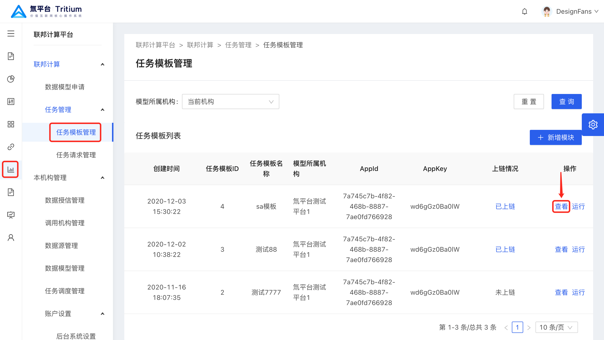
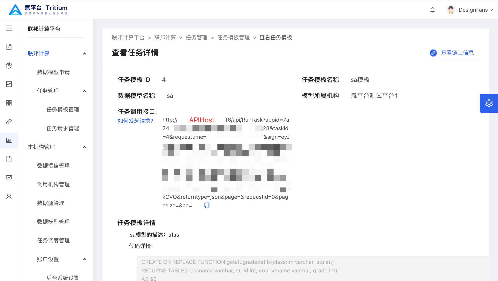
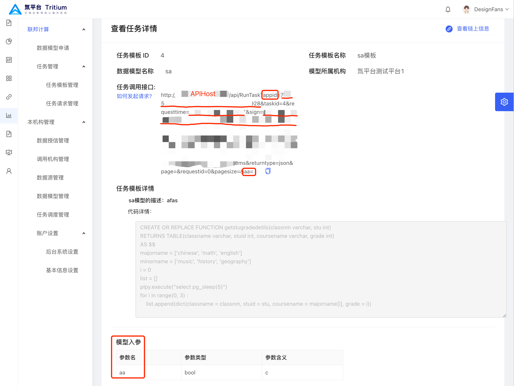

## 跨域联邦计算中发起任务请求

### 前提条件

数据模型申请成功且已生成对应的任务模板

### 操作步骤

1. 进入任务模板管理页面(跨域可信计算->联邦计算->任务管理->任务模板管理),并找到要发起请求的对应模板点击`查看`进入详情





2. 详情界面包含请求时需要用到的 `apiHost`、`appid`及模型需要的参数



3. 根据提供的任务调用接口的参数发起数据请求,除模型参数已有释义外,其余具体参数解释如下：

```js
请求地址:http://HOST/api/Runtask
请求方式:GET
请求参数:
```

|参数名|类型|是否必须|备注|示例|
|-|-|-|-|-|
|appid|string|是|本机构appid|uieoenmhs-sdl|
|task_id|string|是|请求模板id|1|
|request_time|string|是|请求时间(格式:yyyy-mm-dd HH:ii:ss)|2000-01-01 08:00:00l|
|sign|string|是|签名:(taskid+appid+appkey+requestid+request_time进行jwt的hash256加密)|eyJhbGciOiJIUzI1NiIsInR5cCI6IkpXVCJ9.eyJhcHBpZCI6IjdhNzQ1YzdiLTRmODItNDY4Yi04ODg3L|
|returntype|string|是|结果返回类型|json|
|page|string|否|页码|1|
|requestid|string|是|请求id|1|
|pagesize|string|否|页容量|10|
|...|string|是|模型参数|根据模型入参确定-sdl|


