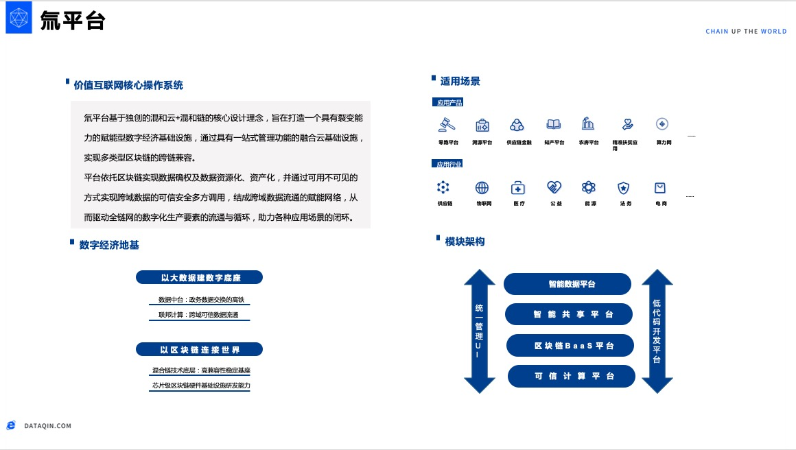

## 氚平台（价值互联网核心操作系统）

“氚Tritium平台”是数秦科技结合大数据与区块链技术开发的新一代企业级产品，是价值互联网核心操作系统，应用“混合云+混合链”技术全面赋能新数字经济建设，实现对政务公共数据源、私域数据源、业务流程数据源的连接、可信安全计算能力与数据分析决策能力，并对商用场景提供区块链快速部署、运维、应用开发与接入运行的基础平台。

氚平台基于独创的“混和云+混和链”核心设计理念，旨在打造一个具有裂变能力的赋能型数字经济基础设施，通过具有一站式管理功能的融合云基础设施，实现多类型区块链的跨链兼容。

平台依托区块链实现数据确权，实现数据资源化、资产化，并通过可用不可见的方式实现跨域数据的可信安全多方调用，结成跨域数据流通的赋能网络，从而驱动全链网的数字化生产要素的流通与循环，助力各种应用场景的闭环。

“氚平台”作为数秦科技核心技术与平台化产品能力的集中体现，促进司法规则网络、金融资源网络、数据资源网络三网高密度的跨域融合聚变与生态裂变。